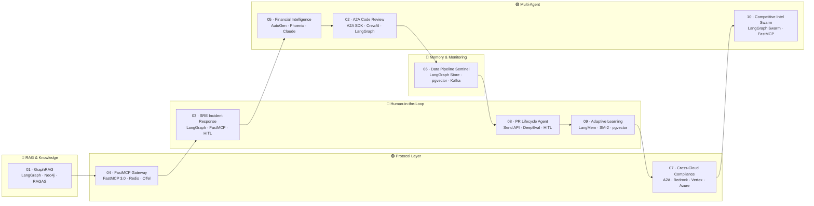

# Agent Blueprints
### 10 Production AI Agent Projects — RAG → MCP → A2A → LangGraph → Swarms

> A progressive, hands-on series covering the full modern agentic AI stack. Every project solves a real problem end-to-end — from environment setup to deployed service with observability.



---

## How to Use This Repo

### If you're new to agentic AI — start here

Follow the numbered order. Each project deliberately builds on concepts from earlier ones.

```
01 → 04 → 03 → 05 → 02 → 06 → 08 → 09 → 07 → 10
RAG  MCP  HITL Multi  A2A  Mem  Eval LMem Cloud Swarm
```

**Recommended pace**: 1 project per week. Each has a self-contained `src/`, `.env.example`, and `docker-compose.yml` so you can run it independently.

### If you're looking for a specific pattern

| I want to learn... | Go to |
|-------------------|-------|
| GraphRAG + hybrid search | [Project 01](./project-01-graphrag-research-engine/) |
| MCP tools, servers, composition | [Project 04](./project-04-mcp-enterprise-gateway/) |
| Human-in-the-loop with `interrupt()` | [Project 03](./project-03-sre-incident-response/), [08](./project-08-pr-lifecycle-agent/) |
| Multi-agent (supervisor/swarm) | [Project 05](./project-05-financial-intelligence/), [10](./project-10-competitive-intelligence/) |
| A2A cross-framework interop | [Project 02](./project-02-a2a-code-review-network/), [07](./project-07-cross-cloud-compliance/) |
| Long-term / episodic memory | [Project 06](./project-06-data-pipeline-sentinel/), [09](./project-09-adaptive-learning-agent/) |
| LLM evaluation in CI/CD | [Project 01](./project-01-graphrag-research-engine/), [08](./project-08-pr-lifecycle-agent/) |
| Observability (OTel / Phoenix) | [Project 04](./project-04-mcp-enterprise-gateway/), [05](./project-05-financial-intelligence/) |
| Multi-cloud deployment | [Project 07](./project-07-cross-cloud-compliance/) |

### How to run any project

```bash
# 1. Enter the project directory
cd project-XX-name

# 2. Install dependencies with uv
uv sync

# 3. Set up environment variables
cp .env.example .env
# Open .env and fill in your API keys

# 4. Start supporting services (Postgres, Redis, Kafka, etc.)
docker compose up -d

# 5. Run the main service
uv run uvicorn src.api:app --reload --port 80XX
```

Each project's README has a **Quick Start** section with the exact commands.

### Reading a project's README effectively

Each README is structured the same way:

1. **Overview** — what problem it solves and why it's non-trivial
2. **Architecture diagram** — Mermaid flowchart + rendered PNG; read this first
3. **Flow** — numbered step-by-step walkthrough of the diagram
4. **Key Concepts** — table of the novel patterns and why they matter
5. **Stack** — exact library versions used
6. **Project Structure** — where to find each piece of code
7. **Quick Start** — commands to run it
8. **Environment Variables** — what each key does

Start with the diagram, then the Flow section — that's usually enough to understand the architecture before reading code.

---

## Project Index

| # | Project | Core Pattern | Key Libraries |
|---|---------|-------------|---------------|
| [01](./project-01-graphrag-research-engine/) | GraphRAG Research Engine | Hybrid search + CRAG loop + RAGAS eval | LangGraph, Neo4j, RAGAS |
| [02](./project-02-a2a-code-review-network/) | A2A Code Review Network | Cross-framework A2A fan-out | A2A SDK, LangGraph, CrewAI |
| [03](./project-03-sre-incident-response/) | SRE Incident Response Agent | HITL + durable checkpointing | LangGraph, FastMCP, PostgreSQL |
| [04](./project-04-mcp-enterprise-gateway/) | FastMCP Enterprise Gateway | MCP composition + Redis cache + OTel | FastMCP 3.0, Redis, OpenTelemetry |
| [05](./project-05-financial-intelligence/) | Financial Intelligence System | Regime-aware SelectorGroupChat | AutoGen, Arize Phoenix |
| [06](./project-06-data-pipeline-sentinel/) | Data Pipeline Sentinel | Episodic memory + anomaly detection | LangGraph Store, pgvector, Kafka |
| [07](./project-07-cross-cloud-compliance/) | Cross-Cloud Compliance Auditor | Multi-cloud A2A federation | A2A, AWS Bedrock, GCP Vertex, Azure |
| [08](./project-08-pr-lifecycle-agent/) | PR Lifecycle Agent | Parallel Send API + confidence-gated HITL | LangGraph, Claude SDK, DeepEval |
| [09](./project-09-adaptive-learning-agent/) | Adaptive Learning Agent | LangMem + SM-2 spaced repetition | LangGraph, LangMem, pgvector |
| [10](./project-10-competitive-intelligence/) | Competitive Intelligence Swarm | Decentralized swarm handoffs | LangGraph Swarm, FastMCP, Streamlit |

---

## Prerequisites

```bash
# Python 3.11+
python --version

# uv — fast package manager (replaces pip/poetry)
curl -LsSf https://astral.sh/uv/install.sh | sh

# Docker — for databases, message queues, cache
docker --version
```

### API Keys by Project

| Project | Anthropic | OpenAI | LangSmith | GCP | AWS | Azure | Other |
|---------|:---------:|:------:|:---------:|:---:|:---:|:-----:|-------|
| 01 | ✅ | ✅ embed | ✅ | — | — | — | — |
| 02 | ✅ | ✅ | optional | — | — | — | GitHub token |
| 03 | ✅ | ✅ embed | ✅ | — | optional | — | — |
| 04 | — | ✅ | — | — | optional | optional | — |
| 05 | — | ✅ | — | — | — | — | FRED API |
| 06 | ✅ | ✅ embed | — | — | optional | — | GitHub token |
| 07 | ✅ | ✅ | — | optional | optional | optional | — |
| 08 | ✅ | ✅ embed | ✅ | — | — | — | GitHub token |
| 09 | ✅ | ✅ embed | ✅ | — | — | — | — |
| 10 | optional | ✅ | ✅ | — | — | — | — |

**Free / easy to get:**
- **LangSmith** — free tier at [smith.langchain.com](https://smith.langchain.com) (no credit card)
- **FRED API** — free at [fred.stlouisfed.org](https://fred.stlouisfed.org/docs/api/api_key.html)
- **GitHub token** — Settings → Developer Settings → Personal Access Tokens
- **Anthropic** — pay-per-use at [platform.anthropic.com](https://platform.anthropic.com)
- **OpenAI** — pay-per-use at [platform.openai.com](https://platform.openai.com)

---

## Learning Path

The numbered order reflects concept dependencies, not difficulty:

```
Week 1-2   │ Project 01 — GraphRAG + Hybrid Search + RAGAS CI
Week 3     │ Project 04 — FastMCP: understand MCP before using it in later projects
Week 4-5   │ Project 03 — LangGraph HITL + durable execution
Week 6-7   │ Project 05 — AutoGen multi-agent + dynamic selector
Week 8     │ Project 02 — A2A protocol: cross-framework interop
Week 9-10  │ Project 06 — Episodic memory + data quality
Week 11    │ Project 08 — Parallel Send API + DeepEval in CI/CD
Week 12    │ Project 09 — LangMem + long-term student memory
Week 13    │ Project 07 — Multi-cloud A2A deployment (needs cloud accounts)
Week 14    │ Project 10 — Swarm: synthesizes all prior patterns
```

---

## Concepts Covered

### Retrieval-Augmented Generation
- Hybrid search: BM25 + dense vectors + Reciprocal Rank Fusion
- Knowledge graph construction and DRIFT traversal
- Corrective RAG (CRAG) with self-evaluation loop
- RAGAS + DeepEval evaluation pipelines

### Agent Patterns
- ReAct with tool use
- Supervisor / orchestrator-worker
- Swarm (decentralized `create_handoff_tool()`)
- Human-in-the-loop: `interrupt()` + `Command(resume=...)`
- Episodic and semantic long-term memory (LangGraph Store + LangMem)

### Protocol Layer
- **MCP**: FastMCP 3.0 tools, resources, prompts, `gateway.mount()` composition, `FastMCP.from_openapi()` proxy
- **A2A**: Agent cards at `/.well-known/agent.json`, task lifecycle, streaming, push notifications, multi-framework interop

### Production Concerns
- Latency: Redis semantic cache, embedding cache, batch retrieval
- Observability: LangSmith, Arize Phoenix, OpenTelemetry GenAI semantic conventions
- Evaluation: RAGAS, DeepEval `GEval` / `HallucinationMetric`, continuous eval in CI
- Durability: `AsyncPostgresSaver` checkpointing for crash-safe long-running agents

### Cloud Deployments
- AWS Bedrock + Lambda
- GCP Vertex AI + Cloud Run
- Azure AI Foundry + Container Apps

---

## Troubleshooting

**Docker services not starting**
```bash
docker compose ps          # check status
docker compose logs <svc>  # check specific service
```

**`interrupt()` raises an error**
A checkpointer is required. Add `InMemorySaver()` for local dev or `AsyncPostgresSaver` for production:
```python
graph = builder.compile(checkpointer=InMemorySaver())
```

**MCP server not connecting**
```bash
curl http://localhost:PORT/mcp/tools/list   # verify server is reachable
```
Check that `BROWSER_MCP_URL` / `GITHUB_MCP_URL` in `.env` matches the running port.

**RAGAS evaluation fails**
RAGAS uses OpenAI as LLM-as-judge internally. `OPENAI_API_KEY` must be set even if you use Claude as the main LLM.

**uv sync fails**
```bash
uv python install 3.11   # install correct Python version
uv sync --reinstall      # force fresh install
```

---

## Stack Reference

| Layer | Libraries |
|-------|-----------|
| Agent Frameworks | LangGraph 0.4, AutoGen (AgentChat), CrewAI, Google ADK |
| LLM Providers | Anthropic Claude (Sonnet 4.6), OpenAI GPT-4o, Google Gemini |
| MCP | FastMCP 3.0, `mcp` SDK, `langchain-mcp-adapters` |
| A2A | `a2a-sdk` (Python), A2A Starlette server |
| Memory | LangMem, LangGraph Store, pgvector |
| Vector / Graph | Neo4j, Chroma, pgvector, BM25 (`rank_bm25`) |
| Evaluation | RAGAS, DeepEval, LangSmith eval suites |
| Observability | LangSmith, Arize Phoenix, OpenTelemetry |
| APIs | FastAPI, WebSocket, SSE |
| Infrastructure | Docker Compose, PostgreSQL, Redis, Kafka |
| Cloud | AWS Bedrock, GCP Vertex AI, Azure AI Foundry |

---

*Aligned with LangGraph v0.4 · A2A v0.3 · FastMCP 3.0 · MCP spec 2025-11-05 · Claude Sonnet 4.6*
