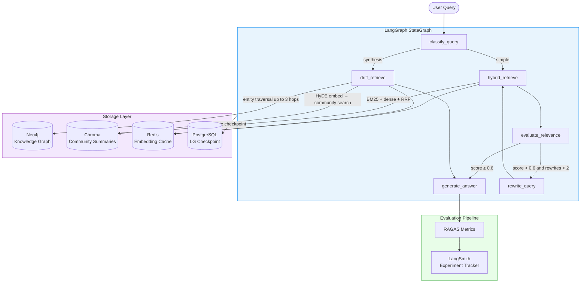

# Project 01 · GraphRAG Research Engine

> Adaptive knowledge-graph RAG with DRIFT search, Corrective RAG loop, and RAGAS evaluation CI/CD

---

## Overview

Ingests documents into a **Neo4j knowledge graph**, detects communities via Leiden algorithm, and answers research questions using **DRIFT-style traversal** (HyDE embedding → community search → graph hop). When retrieved context is weak, a **Corrective RAG** loop rewrites the query and re-retrieves before generating. Every answer is scored by RAGAS and tracked in LangSmith.

---

## Architecture




---

## Flow

1. **classify_query** — LLM decides: simple fact lookup → `hybrid_retrieve`; synthesis/trend question → `drift_retrieve`
2. **hybrid_retrieve** — BM25 (rank_bm25) + dense (Chroma) run concurrently, merged with Reciprocal Rank Fusion
3. **drift_retrieve** — Generates a hypothetical answer (HyDE), embeds it, finds top communities, then BFS-traverses the Neo4j graph up to 3 hops for specific entities
4. **evaluate_relevance** — LLM scores context 0–1. Below 0.6 triggers query rewrite (max 2 retries)
5. **generate_answer** — Citations inline from retrieved chunks
6. **RAGAS** — Faithfulness, Answer Relevancy, Context Precision, Context Recall — pushed to LangSmith

---

## Key Concepts

| Concept | Description |
|---------|-------------|
| **GraphRAG / DRIFT** | Community summaries + dynamic graph traversal — better than pure vector RAG for synthesis questions |
| **Corrective RAG** | Self-evaluation loop: low relevance → rewrite → re-retrieve → generate |
| **Hybrid Search + RRF** | BM25 handles rare terms; dense vectors handle semantics; RRF fuses both without tuning weights |
| **HyDE** | Embed a hypothetical answer instead of the raw query for community search — reduces the query-document gap |
| **RAGAS in CI/CD** | Set `CI_FAIL_ON_FAITHFULNESS_BELOW=0.80` to fail builds on model regressions |
| **Embedding Cache** | Redis caches query embeddings for 1h — eliminates repeated OpenAI calls for identical/near-identical queries |

---

## Stack

| Layer | Library | Version |
|-------|---------|---------|
| Agent Framework | LangGraph | ≥ 0.4.0 |
| LLM | Claude Sonnet 4.6 (Anthropic) | — |
| Graph DB | Neo4j + GDS plugin | 5.18 |
| Vector Store | Chroma | ≥ 0.6.0 |
| Sparse Retrieval | rank-bm25 | ≥ 0.2.2 |
| Evaluation | RAGAS | ≥ 0.2.0 |
| Tracing | LangSmith | ≥ 0.2.0 |
| Cache | Redis | 7.2 |
| Checkpoint | PostgreSQL (asyncpg) | 16 |
| API | FastAPI + uvicorn | ≥ 0.115.0 |

---

## Project Structure

```
project-01-graphrag-research-engine/
├── .env.example              # All config with descriptions
├── docker-compose.yml        # Neo4j · Chroma · Redis · PostgreSQL
├── pyproject.toml
└── src/
    ├── config.py             # Pydantic Settings (all env vars)
    ├── graph_builder.py      # Document → entity extraction → Neo4j ingestion → community detection
    ├── retrieval.py          # HybridRetriever (BM25 + dense + RRF) · DRIFTRetriever
    ├── agent.py              # LangGraph StateGraph (CRAG loop)
    ├── evaluation.py         # RAGAS runner + LangSmith push + CI threshold check
    └── api.py                # FastAPI: POST /research · POST /research/stream · GET /health
```

---

## Quick Start

```bash
# 1. Install
cd project-01-graphrag-research-engine
uv sync

# 2. Start infrastructure
docker compose up -d
# Wait ~30s for Neo4j to be healthy

# 3. Configure
cp .env.example .env
# Fill: ANTHROPIC_API_KEY, OPENAI_API_KEY, LANGSMITH_API_KEY

# 4. Ingest documents
uv run python -m src.graph_builder --ingest "data/papers/*.pdf"

# 5. Serve
uv run uvicorn src.api:app --reload --port 8001

# 6. Query
curl -X POST http://localhost:8001/research \
  -H "Content-Type: application/json" \
  -d '{"query": "What are the main failure modes of RAG systems?"}'

# 7. Stream (SSE)
curl -N -X POST http://localhost:8001/research/stream \
  -H "Content-Type: application/json" \
  -d '{"query": "Compare DRIFT and standard RAG retrieval"}'
```

---

## Environment Variables

| Variable | Description | Default |
|----------|-------------|---------|
| `ANTHROPIC_API_KEY` | Claude API key | required |
| `OPENAI_API_KEY` | Embeddings (text-embedding-3-small) | required |
| `LANGSMITH_API_KEY` | Tracing + eval tracking | optional |
| `NEO4J_URI` | Graph DB connection | `bolt://localhost:7687` |
| `HYBRID_SEARCH_TOP_K` | Documents fetched before reranking | `20` |
| `RERANKER_TOP_K` | Documents passed to generation | `5` |
| `DRIFT_MAX_HOPS` | Max BFS hops in graph traversal | `3` |
| `SEMANTIC_CACHE_SIMILARITY_THRESHOLD` | Cache hit threshold (0–1) | `0.92` |
| `CI_FAIL_ON_FAITHFULNESS_BELOW` | CI failure threshold | `0.80` |

---

## Evaluation

```bash
# Run against golden test set — exits non-zero if faithfulness < threshold
uv run python -m src.evaluation --dataset data/eval_dataset.json

# Output example:
# ✓ faithfulness               0.847
# ✓ answer_relevancy           0.921
# ✓ context_precision          0.788
# ✓ context_recall             0.812
```

**Dataset format** (`data/eval_dataset.json`):
```json
[
  {
    "question": "What is DRIFT search?",
    "ground_truth": "DRIFT combines global community search with local graph traversal...",
    "answer": "...",
    "contexts": ["chunk1", "chunk2"]
  }
]
```

---

## Latency Profile

| Operation | Cold | Cached |
|-----------|------|--------|
| Query embedding | ~80ms | ~2ms |
| BM25 search | ~15ms | — |
| Chroma dense search | ~60ms | — |
| Community search (DRIFT) | ~120ms | ~5ms |
| Graph traversal (3 hops) | ~200ms | — |
| LLM generation | ~1.2s | — |
| **Total P50** | **~1.7s** | **~1.3s** |
