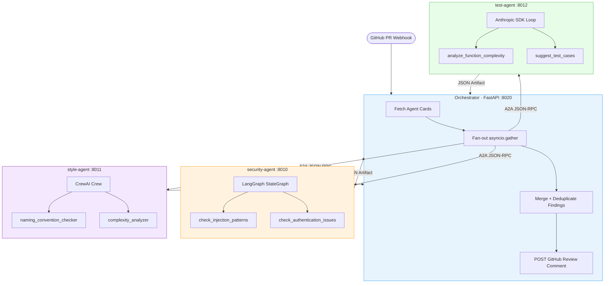

# Project 02 · A2A Multi-Framework Code Review Network

> Heterogeneous specialist agents communicating via Google A2A protocol — security on LangGraph, style on CrewAI, test coverage on raw Anthropic SDK

---

## Overview

An orchestrator receives a GitHub PR diff and fans it out **concurrently** to three specialist agents — each built with a different framework — using the A2A (Agent-to-Agent) protocol. The orchestrator is framework-agnostic: it discovers capabilities from **agent cards**, delegates subtasks by skill tag, and assembles findings into a structured GitHub review comment.

This is the canonical A2A use case: incompatible agent frameworks collaborating on a shared task with each agent's internals completely hidden behind a standard JSON-RPC interface.

---

## Architecture




---

## Flow

1. **GitHub webhook** fires on PR open/sync → orchestrator receives diff
2. **Agent card fetch** — orchestrator GETs `/.well-known/agent.json` from each specialist (cached 5min)
3. **Parallel fan-out** — `asyncio.gather()` sends the diff to all three agents simultaneously via A2A `message/send`
4. **Each specialist** runs its internal framework (LangGraph/CrewAI/Anthropic) and returns a JSON Artifact with structured findings
5. **Merge & deduplicate** — findings sorted by severity; duplicates across agents collapsed
6. **GitHub comment** — formatted Markdown review posted inline via PyGithub

Total latency ≈ slowest single agent (not sum of all three).

---

## Key Concepts

| Concept | Description |
|---------|-------------|
| **Agent Cards** | `/.well-known/agent.json` — skill tags, input/output modes, streaming support |
| **A2A Task Lifecycle** | `submitted → working → completed` (or `input-required` for clarifications) |
| **Artifacts** | Structured JSON returned from agents (vs plain text messages) |
| **Parallel Fan-out** | `asyncio.gather()` across three A2A calls — latency = max, not sum |
| **Cross-Framework Interop** | LangGraph, CrewAI, raw SDK behind one JSON-RPC interface |
| **SSE Streaming** | Partial results streamed as agents work via `message/stream` |
| **AgentExecutor** | A2A server-side class: `execute()` and `cancel()` methods |

---

## Stack

| Layer | Library | Version |
|-------|---------|---------|
| A2A Protocol | a2a-sdk | ≥ 0.3.0 |
| Agent: Security | LangGraph | ≥ 0.4.0 |
| Agent: Style | CrewAI | ≥ 0.80.0 |
| Agent: Test | anthropic | ≥ 0.40.0 |
| LLM (security + test) | Claude Sonnet 4.6 | — |
| LLM (style) | OpenAI GPT-4o | — |
| GitHub Integration | PyGithub | ≥ 2.3.0 |
| API | FastAPI + uvicorn | ≥ 0.115.0 |

---

## Project Structure

```
project-02-a2a-code-review-network/
├── .env.example
├── docker-compose.yml
├── pyproject.toml
└── src/
    ├── __init__.py
    ├── agents/
    │   ├── __init__.py
    │   ├── security_agent.py    # LangGraph + A2AStarletteApplication
    │   ├── style_agent.py       # CrewAI Crew + A2A server
    │   └── test_agent.py        # Raw Anthropic SDK agentic loop + A2A
    ├── orchestrator.py          # A2AClient fan-out + RRF severity sort
    └── api.py                   # FastAPI: /webhook/github + /review
```

---

## Quick Start

```bash
cd project-02-a2a-code-review-network
uv sync
cp .env.example .env
# Fill: ANTHROPIC_API_KEY, OPENAI_API_KEY, GITHUB_TOKEN

# Start specialist agents (separate terminals or background)
uv run python -m src.agents.security_agent &   # :8010
uv run python -m src.agents.style_agent &      # :8011
uv run python -m src.agents.test_agent &       # :8012

# Start the orchestrator
uv run uvicorn src.api:app --port 8020

# Trigger a manual review (no GitHub webhook needed)
curl -X POST http://localhost:8020/review \
  -H "Content-Type: application/json" \
  -d '{
    "pr_url": "https://github.com/owner/repo/pull/42",
    "diff": "--- a/auth.py\n+++ b/auth.py\n+query = f\"SELECT * FROM users WHERE id={user_id}\"\n+cursor.execute(query)"
  }'
```

---

## Environment Variables

| Variable | Description | Default |
|----------|-------------|---------|
| `ANTHROPIC_API_KEY` | Claude API key | required |
| `OPENAI_API_KEY` | GPT-4o for style agent | required |
| `GITHUB_TOKEN` | Post review comments | required |
| `GITHUB_WEBHOOK_SECRET` | Validate webhook signatures | required |
| `SECURITY_AGENT_URL` | Security agent base URL | `http://localhost:8010` |
| `STYLE_AGENT_URL` | Style agent base URL | `http://localhost:8011` |
| `TEST_AGENT_URL` | Test agent base URL | `http://localhost:8012` |
| `AGENT_CARD_CACHE_TTL` | Agent card cache seconds | `300` |

---

## A2A Protocol Reference

Each specialist exposes two endpoints:

```
GET  /.well-known/agent.json    # Agent card (skills, capabilities)
POST /                          # JSON-RPC 2.0 (message/send, message/stream)
```

### Agent Card (security-agent)

```json
{
  "name": "Security Review Agent",
  "url": "http://localhost:8010/",
  "capabilities": { "streaming": true },
  "skills": [{
    "id": "security_review",
    "name": "Security Code Review",
    "description": "Analyzes code diffs for OWASP Top 10, injection, secrets exposure",
    "tags": ["security", "vulnerability", "owasp"],
    "inputModes": ["text/plain"],
    "outputModes": ["application/json"]
  }]
}
```

### Artifact Schema (returned by each agent)

```json
{
  "findings": [
    {
      "severity": "CRITICAL",
      "type": "sql_injection",
      "file": "auth.py",
      "line": 15,
      "message": "Unsanitized user input in SQL query — use parameterized query",
      "cwe": "CWE-89"
    }
  ],
  "agent": "security-agent",
  "framework": "langgraph",
  "analyzed_at": "2026-03-17T14:23:00Z"
}
```

---

## Latency Profile

| Operation | Latency |
|-----------|---------|
| Agent card fetch (cached) | ~2ms |
| Security agent (LangGraph) | ~1.8s |
| Style agent (CrewAI) | ~2.1s |
| Test agent (Anthropic SDK) | ~1.5s |
| **Total (parallel)** | **~2.1s** |
| GitHub comment POST | ~300ms |
