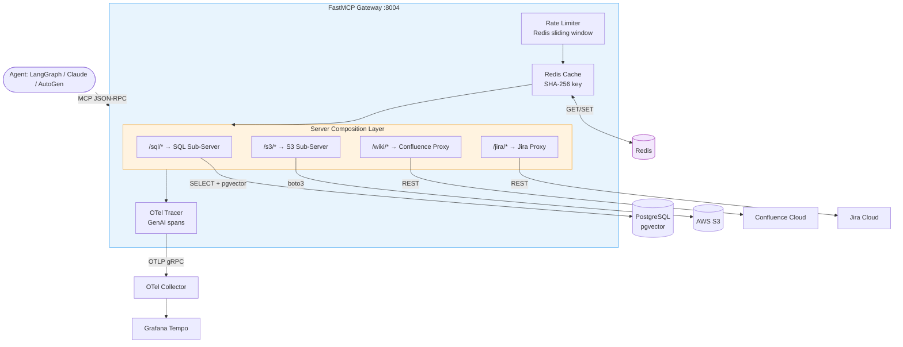

# Project 04 · FastMCP Enterprise Data Gateway

> Composable MCP gateway unifying SQL, S3, Confluence, and Jira under one endpoint — with Redis caching, sliding-window rate limiting, and OpenTelemetry GenAI traces

---

## Overview

Enterprise AI agents need to query 5–10 different data systems per task. Each has a different API, auth scheme, and latency profile. This project builds a **single MCP gateway** that composes four specialized sub-servers under one namespace, adds Redis caching per tool call, enforces per-client rate limits, and emits OpenTelemetry spans with GenAI semantic conventions to Grafana Tempo.

Any agent (LangGraph, Claude, AutoGen) connects to one endpoint and gets access to all data sources transparently — without knowing SQL from S3.

---

## Architecture




---

## Flow

1. Agent sends MCP JSON-RPC call to gateway (e.g., `sql/sql_query`)
2. **Rate limiter** checks Redis sorted set — rejects if client exceeds RPM quota
3. **Cache** checks Redis for `sha256(tool_name + sorted_args)` — returns cached response if hit
4. **Sub-server** handles the tool call (SQL query, S3 fetch, Confluence page, Jira issue)
5. **OTel tracer** wraps every call with a span: `gen_ai.tool.name`, `gen_ai.tool.input`, `cache.hit`, `duration_ms`
6. Response returned to agent; cache populated on miss

---

## Key Concepts

| Concept | Description |
|---------|-------------|
| **Server Composition** | `gateway.mount("/sql", sql_server)` — namespaced tool routing |
| **FastMCP Proxy** | `FastMCP.from_openapi(spec_url)` auto-generates MCP tools from OpenAPI specs |
| **Redis Cache** | `@cached(ttl=N)` decorator — key = SHA-256(tool + args), TTL per tool |
| **Rate Limiting** | Redis sorted set sliding window — `ZREMRANGEBYSCORE` + `ZADD` per request |
| **OTel GenAI Conventions** | `gen_ai.system`, `gen_ai.tool.name`, `gen_ai.tool.input` span attributes |
| **MCP Context** | `ctx.report_progress()`, `ctx.info()` for long-running tool calls |
| **MCP Resources** | URI templates: `s3://bucket/{key}`, `sql://schema/{table}` |

---

## Stack

| Layer | Library | Version |
|-------|---------|---------|
| MCP Framework | FastMCP | ≥ 3.0.0 |
| Cache + Rate Limit | Redis (hiredis) | ≥ 5.0.0 |
| SQL + Vector | PostgreSQL + pgvector | 16 |
| S3 Client | boto3 | ≥ 1.34.0 |
| Tracing | opentelemetry-sdk | ≥ 1.28.0 |
| Trace Export | opentelemetry-exporter-otlp-proto-grpc | ≥ 1.28.0 |
| API | FastAPI + uvicorn | ≥ 0.115.0 |

---

## Project Structure

```
project-04-mcp-enterprise-gateway/
├── .env.example
├── docker-compose.yml          # Redis · PostgreSQL · OTel Collector · Grafana · Tempo
├── pyproject.toml
├── otel/
│   ├── otel-collector-config.yaml
│   └── grafana-datasources.yaml
└── src/
    ├── __init__.py
    ├── servers/
    │   ├── __init__.py
    │   ├── sql_server.py         # SELECT + pgvector cosine search
    │   ├── s3_server.py          # List, get, search S3 objects
    │   ├── confluence_server.py  # Confluence REST proxy
    │   └── jira_server.py        # Jira REST proxy
    ├── middleware/
    │   ├── __init__.py
    │   ├── cache.py              # @cached(ttl=N) decorator
    │   ├── rate_limiter.py       # Sliding window per client IP
    │   └── tracer.py             # @traced decorator → OTel spans
    ├── gateway.py                # Composition + middleware wiring
    └── config.py                 # Pydantic Settings
```

---

## Quick Start

```bash
cd project-04-mcp-enterprise-gateway
uv sync
cp .env.example .env
# Fill: AWS_ACCESS_KEY_ID, AWS_SECRET_ACCESS_KEY, CONFLUENCE_TOKEN, JIRA_TOKEN

# Start all infrastructure
docker compose up -d
# Redis, PostgreSQL, OTel Collector, Grafana, Tempo

# Start the gateway
uv run python -m src.gateway

# Test with FastMCP client
python -c "
import asyncio
from fastmcp import Client

async def test():
    async with Client('http://localhost:8004/mcp') as c:
        tools = await c.list_tools()
        print([t.name for t in tools])
        result = await c.call_tool('sql/sql_query', {'sql': 'SELECT count(*) FROM users'})
        print(result)

asyncio.run(test())
"
```

---

## Environment Variables

| Variable | Description | Default |
|----------|-------------|---------|
| `REDIS_URL` | Cache + rate limit store | `redis://localhost:6379` |
| `POSTGRES_URI` | SQL data source | `postgresql://gw:gw@localhost:5432/gw` |
| `AWS_ACCESS_KEY_ID` | S3 access | required |
| `AWS_SECRET_ACCESS_KEY` | S3 secret | required |
| `S3_BUCKET` | Default S3 bucket | required |
| `CONFLUENCE_BASE_URL` | Confluence instance | required |
| `CONFLUENCE_TOKEN` | Confluence API token | required |
| `JIRA_BASE_URL` | Jira instance | required |
| `JIRA_TOKEN` | Jira API token | required |
| `RATE_LIMIT_RPM` | Requests per minute per client | `100` |
| `RATE_LIMIT_BURST` | Burst allowance | `20` |
| `OTEL_EXPORTER_OTLP_ENDPOINT` | OTel collector gRPC | `http://localhost:4317` |
| `GATEWAY_PORT` | MCP server port | `8004` |

---

## Cache Configuration

Configure TTL per tool by applying the `@cached` decorator:

```python
@cached(ttl=300)     # 5 min — frequently queried records
@mcp.tool
async def sql_query(sql: str) -> list[dict]: ...

@cached(ttl=3600)    # 1 hour — relatively static pages
@mcp.tool
async def get_confluence_page(page_id: str) -> str: ...

@cached(ttl=0)       # No cache — always live
@mcp.tool
async def get_jira_issue_status(issue_key: str) -> dict: ...
```

Cache keys use `sha256(tool_name + json.dumps(sorted(kwargs.items())))` — identical calls always hit the same key.

---

## OTel Trace Schema

Every tool call produces a span visible in Grafana Tempo:

```
Span: mcp.tool_call
  gen_ai.system           = "mcp"
  gen_ai.tool.name        = "sql/sql_query"
  gen_ai.tool.input       = {"sql": "SELECT count(*) FROM users"}
  gen_ai.tool.output_len  = 42
  cache.hit               = false
  rate_limit.remaining    = 87
  http.status_code        = 200
  duration_ms             = 134
```

View at `http://localhost:3000` → Explore → Tempo. Filter by `gen_ai.tool.name` to find slow tools.

---

## Rate Limiting

When a client exceeds the RPM quota, the gateway returns a JSON-RPC error:

```json
{
  "jsonrpc": "2.0",
  "error": {
    "code": -32000,
    "message": "Rate limit exceeded. Retry after 23s"
  }
}
```

Adjust limits per client by setting `RATE_LIMIT_RPM` in `.env` or overriding via the admin endpoint:

```bash
# Increase limit for a trusted client
curl -X PUT http://localhost:8004/admin/rate-limit \
  -H "Content-Type: application/json" \
  -d '{"client_ip": "10.0.0.5", "rpm": 500}'
```
