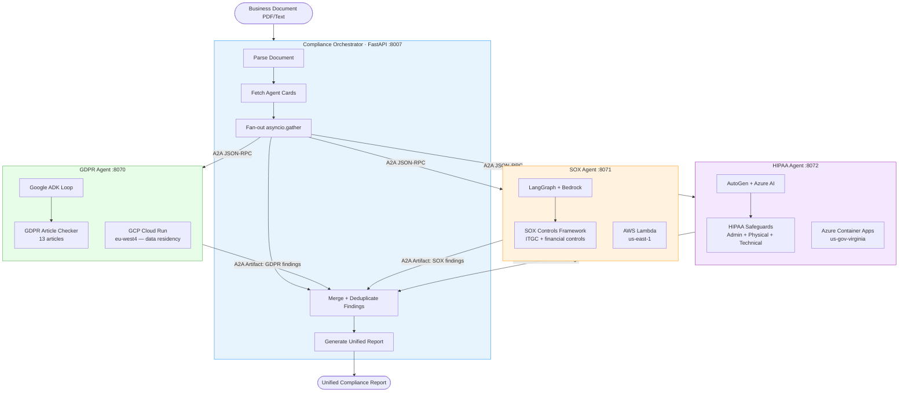

# Project 07 · Cross-Cloud Compliance Auditor

> A2A-federated compliance mesh — GDPR on GCP, SOX on AWS Bedrock, HIPAA on Azure AI Foundry — all orchestrated from a single FastAPI coordinator

---

## Overview

A compliance platform where each regulatory domain runs as an independent agent deployed on the most appropriate cloud. The orchestrator receives a business document, fans it out to all three compliance agents via A2A, collects structured findings as artifacts, and assembles a unified compliance report.

**Why multi-cloud matters for compliance**: GDPR agents must run in EU regions (data residency); SOX controls often live in existing AWS contracts; HIPAA workloads may be mandated on Azure. A2A makes cross-cloud agent interop natural without coupling the orchestrator to any specific cloud SDK.

---

## Architecture




---

## Flow

1. **Document upload** → orchestrator parses PDF/text, splits into chunks if > 50 pages
2. **Agent card fetch** — discovers each specialist's skills from `/.well-known/agent.json`
3. **Parallel A2A dispatch** — `asyncio.gather()` sends document to all three agents
4. **Each specialist** runs its internal framework, checks against regulatory articles/controls, returns structured JSON artifact
5. **Merge** — findings deduplicated by regulation + article + location; sorted by severity
6. **Report assembly** — unified PDF/Markdown report with overall compliance score per regulation

For large documents: agents use **A2A push notifications** — they accept the task, return a `task_id`, and POST back to the orchestrator's callback URL when analysis is complete.

---

## Key Concepts

| Concept | Description |
|---------|-------------|
| **A2A Artifacts** | Structured JSON returned from remote agents (not plain text) |
| **Push Notifications** | Async A2A completion via webhook — for long-running analysis |
| **Multi-Cloud Deployment** | Cloud Run (GCP), Lambda (AWS), Container Apps (Azure) |
| **Document Chunking** | Large docs split to fit LLM context windows per agent |
| **Cross-Framework A2A** | Google ADK, LangGraph, AutoGen all behind one A2A interface |
| **Data Residency** | GDPR agent forced to EU region via Cloud Run `--region europe-west4` |

---

## Stack

| Layer | Library | Version |
|-------|---------|---------|
| A2A Protocol | a2a-sdk | ≥ 0.3.0 |
| GDPR Agent | Google Agent Development Kit (ADK) | ≥ 0.5.0 |
| SOX Agent | LangGraph + AWS Bedrock (Claude) | ≥ 0.4.0 |
| HIPAA Agent | AutoGen AgentChat + Azure AI | ≥ 0.4.0 |
| Orchestrator | FastAPI + httpx | ≥ 0.115.0 |
| PDF Parsing | pypdf | ≥ 4.0.0 |

---

## Project Structure

```
project-07-cross-cloud-compliance/
├── .env.example
├── pyproject.toml
├── orchestrator/
│   ├── Dockerfile
│   ├── main.py               # FastAPI + A2A client fan-out
│   └── report_generator.py   # Unified report assembly
├── gdpr_agent/
│   ├── Dockerfile
│   ├── main.py               # Google ADK + A2AStarletteApplication
│   └── gdpr_rules.py         # GDPR article checklist (Art. 5-89)
├── sox_agent/
│   ├── Dockerfile
│   ├── main.py               # LangGraph + Bedrock (Claude) + A2A server
│   └── sox_controls.py       # ITGC + financial control framework
└── hipaa_agent/
    ├── Dockerfile
    ├── main.py               # AutoGen + Azure OpenAI + A2A server
    └── hipaa_rules.py        # HIPAA administrative/physical/technical safeguards
```

---

## Quick Start (Local)

```bash
cd project-07-cross-cloud-compliance
uv sync
cp .env.example .env
# Fill: GOOGLE_API_KEY, AWS_ACCESS_KEY_ID, AZURE_OPENAI_KEY, ANTHROPIC_API_KEY

# Start all agents locally
uvicorn gdpr_agent.main:app --port 8070 &
uvicorn sox_agent.main:app --port 8071 &
uvicorn hipaa_agent.main:app --port 8072 &
uvicorn orchestrator.main:app --port 8007

# Submit a document for compliance review
curl -X POST http://localhost:8007/audit \
  -F "file=@/path/to/data_processing_agreement.pdf" \
  -F 'regulations=["gdpr","sox","hipaa"]'
```

---

## Cloud Deployment

```bash
# GDPR Agent → GCP Cloud Run (EU data residency)
gcloud run deploy gdpr-agent \
  --image gcr.io/PROJECT/gdpr-agent:latest \
  --region europe-west4 \
  --set-env-vars GOOGLE_API_KEY=...

# SOX Agent → AWS Lambda (container image)
aws lambda create-function \
  --function-name sox-compliance-agent \
  --package-type Image \
  --code ImageUri=ACCOUNT.dkr.ecr.us-east-1.amazonaws.com/sox-agent:latest \
  --role arn:aws:iam::ACCOUNT:role/lambda-a2a-role

# HIPAA Agent → Azure Container Apps
az containerapp create \
  --name hipaa-agent \
  --resource-group compliance-rg \
  --environment compliance-env \
  --image ACR.azurecr.io/hipaa-agent:latest \
  --env-vars AZURE_OPENAI_KEY=secretref:openai-key
```

---

## Environment Variables

| Variable | Description | Default |
|----------|-------------|---------|
| `GOOGLE_API_KEY` | Gemini for GDPR agent | required |
| `AWS_ACCESS_KEY_ID` | Bedrock access (SOX) | required |
| `AWS_SECRET_ACCESS_KEY` | Bedrock secret (SOX) | required |
| `AZURE_OPENAI_ENDPOINT` | Azure OpenAI (HIPAA) | required |
| `AZURE_OPENAI_KEY` | Azure OpenAI key | required |
| `ANTHROPIC_API_KEY` | Claude for orchestrator LLM | required |
| `GDPR_AGENT_URL` | GDPR agent URL | `http://localhost:8070` |
| `SOX_AGENT_URL` | SOX agent URL | `http://localhost:8071` |
| `HIPAA_AGENT_URL` | HIPAA agent URL | `http://localhost:8072` |
| `ORCHESTRATOR_CALLBACK_URL` | Push notification webhook | required for large docs |

---

## A2A Artifact Schema

Each compliance agent returns a structured finding artifact:

```json
{
  "regulation": "GDPR",
  "compliance_status": "PARTIAL",
  "overall_score": 72,
  "findings": [
    {
      "article": "Art. 13 — Right to be informed",
      "status": "NON_COMPLIANT",
      "severity": "HIGH",
      "finding": "Data retention periods not specified in processing agreement",
      "recommendation": "Add explicit retention period per Art. 13(2)(a) in Section 4.2",
      "reference": "GDPR Art. 13(2)(a)"
    }
  ],
  "agent_version": "1.0.0",
  "analyzed_at": "2026-03-17T14:23:00Z"
}
```

---

## Push Notification Pattern

For documents over 50 pages, agents process asynchronously:

```python
# Orchestrator registers callback, gets task_id immediately
response = await a2a_client.send_message_with_push_notification(
    message={"text": document_text},
    notification_config={"url": "https://orchestrator.example.com/callback"}
)
# task_id = response.task_id

# Minutes later, agent POSTs to callback with completed findings
# Orchestrator /callback endpoint assembles the final report
```
