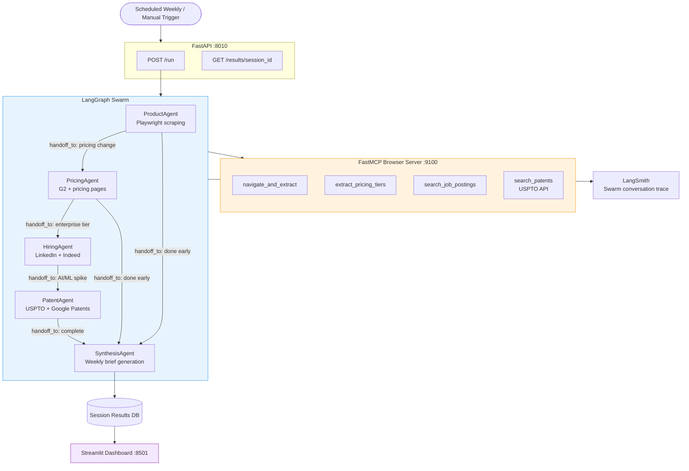

# Project 10 · Competitive Intelligence Swarm

> LangGraph Swarm with decentralized agent handoffs across product, pricing, hiring, and patent signals — synthesized into weekly intelligence briefs via Streamlit

---

## Overview

A competitive intelligence network where specialist agents autonomously monitor different signal sources and **hand off to each other** based on what they discover — no central supervisor needed. Unlike a supervisor architecture, this **swarm** lets each agent decide who to engage next.

Start with "check competitor X's product page" and the swarm autonomously threads together: product change → pricing signal → enterprise hiring spike → related patent filing → synthesis brief.

| Agent | Signal Source | Handoff Trigger |
|-------|--------------|-----------------|
| `ProductAgent` | Competitor websites, changelogs | Pricing change detected |
| `PricingAgent` | Pricing pages, G2/Capterra | Enterprise tier added |
| `HiringAgent` | LinkedIn, Indeed, job boards | AI/ML role spike |
| `PatentAgent` | USPTO, Google Patents | Related patent filed |
| `SynthesisAgent` | All agent outputs | Called as final step |

---

## Architecture




---

## Flow

1. **Trigger** — weekly APScheduler cron or manual `POST /run` with competitor URLs
2. **ProductAgent** starts — uses Playwright MCP tools to scrape competitor pages for changes
3. **Handoffs** — each agent uses `create_handoff_tool()` to pass control + context to the next agent when it detects a signal warranting deeper investigation
4. **SynthesisAgent** — called last; integrates all findings into a structured brief
5. **LangSmith** traces the full agent handoff chain for debugging
6. **Streamlit** dashboard displays the brief + signal chain + past runs

---

## Key Concepts

| Concept | Description |
|---------|-------------|
| **LangGraph Swarm** | `create_swarm()` + `create_handoff_tool()` — decentralized routing |
| **Swarm vs Supervisor** | No central orchestrator; agents decide who goes next based on findings |
| **FastMCP Browser** | Playwright wrapped as MCP tools for structured web extraction |
| **Scheduled Agent Runs** | APScheduler weekly cron triggers full swarm run |
| **Cross-Domain Signals** | Product → pricing → hiring → patents — connected automatically |
| **LangSmith Tracing** | Full swarm conversation flow visible in LangSmith UI |

---

## Stack

| Layer | Library | Version |
|-------|---------|---------|
| Swarm Framework | langgraph-swarm | ≥ 0.0.5 |
| Agent Framework | LangGraph | ≥ 0.4.0 |
| Browser Automation | Playwright + FastMCP | ≥ 3.0.0 |
| LLM | OpenAI GPT-4o (configurable) | — |
| Scheduling | APScheduler | ≥ 3.10.0 |
| Tracing | LangSmith | ≥ 0.2.0 |
| Dashboard | Streamlit | ≥ 1.35.0 |
| API | FastAPI + uvicorn | ≥ 0.115.0 |

---

## Project Structure

```
project-10-competitive-intelligence/
├── .env.example
├── docker-compose.yml
├── pyproject.toml
└── src/
    ├── __init__.py
    ├── agents/
    │   ├── __init__.py
    │   ├── product_agent.py      # Playwright scraping + changelog diffing
    │   ├── pricing_agent.py      # Tier detection + G2/Capterra
    │   ├── hiring_agent.py       # Job board role spike detection
    │   ├── patent_agent.py       # USPTO API + Google Patents
    │   └── synthesis_agent.py    # Weekly brief assembly
    ├── mcp_browser/
    │   └── browser_mcp.py        # FastMCP: Playwright tools
    ├── swarm.py                  # create_swarm() + handoff tools wiring
    ├── scheduler.py              # APScheduler weekly trigger
    ├── api.py                    # FastAPI: /run, /results, /results/{session_id}
    └── dashboard.py              # Streamlit intelligence brief viewer
```

---

## Quick Start

```bash
cd project-10-competitive-intelligence
uv sync
cp .env.example .env
# Fill: OPENAI_API_KEY, LANGSMITH_API_KEY (optional)

# Install Playwright browsers
uv run playwright install chromium

# Start browser MCP server
uv run python -m src.mcp_browser.browser_mcp &   # port 9100

# Start the API
uv run uvicorn src.api:app --port 8010

# Start the Streamlit dashboard
uv run streamlit run src/dashboard.py --server.port 8501

# Trigger a manual run
curl -X POST http://localhost:8010/run \
  -H "Content-Type: application/json" \
  -d '{"competitors": ["competitor-a.com", "competitor-b.io"]}'

# Start the weekly scheduler
uv run python -m src.scheduler
```

---

## Environment Variables

| Variable | Description | Default |
|----------|-------------|---------|
| `OPENAI_API_KEY` | GPT-4o for all agents | required |
| `LANGSMITH_API_KEY` | Swarm tracing | optional |
| `LANGCHAIN_PROJECT` | LangSmith project name | `competitive-intel` |
| `BROWSER_MCP_URL` | Playwright MCP server | `http://localhost:9100` |
| `SCHEDULE_CRON` | Weekly run schedule | `0 8 * * MON` |
| `MAX_SCRAPE_DEPTH` | Max pages per competitor | `5` |
| `PATENT_SEARCH_MONTHS` | USPTO lookback window | `90` |

---

## Swarm vs. Supervisor

This project uses **Swarm** rather than Supervisor because:

- Competitive intelligence has no predefined agent ordering — signals may or may not exist
- Each agent discovers signals that *may* warrant deeper investigation by another agent
- A supervisor would require modeling all possible cross-domain relationships upfront
- Swarm handles this dynamically: if PatentAgent finds nothing, it hands off to Synthesis directly

**Trade-off**: Swarm passes full conversation context on each handoff (more tokens) but produces more relevant, signal-driven flows than a fixed pipeline.

---

## FastMCP Browser Tools

```python
@mcp.tool
async def navigate_and_extract(url: str, css_selector: str) -> str:
    """Navigate to URL and extract text matching CSS selector."""

@mcp.tool
async def extract_pricing_tiers(url: str) -> list[dict]:
    """Extract structured pricing tiers using LLM + Playwright."""

@mcp.tool
async def search_job_postings(company: str, keywords: list[str], days: int = 60) -> list[dict]:
    """Search multiple job boards for company postings matching keywords."""

@mcp.tool
async def search_patents(company: str, months: int = 90) -> list[dict]:
    """Search USPTO API for recent patent filings by company."""
```

---

## Sample Intelligence Brief

```markdown
# Competitive Intelligence Brief — Week of March 17, 2026

## Executive Summary
Competitor A launched an Enterprise tier (3× price increase from $299 → $999/user/mo).
This follows a 47% spike in enterprise sales hiring over 60 days and 2 recent patents
on multi-tenant data isolation. **Recommend: accelerate enterprise feature roadmap.**

## Signal Chain
1. ProductAgent: New "Enterprise" tab appeared on competitor-a.com/pricing
2. PricingAgent: Enterprise tier confirmed — $999/user/mo (prev: $299)
3. HiringAgent: 23 enterprise/sales roles posted in past 60 days (+47%)
4. PatentAgent: US20260123456 — "Isolated Tenant Data Processing Architecture"
5. SynthesisAgent: Connected signals → coordinated enterprise market expansion strategy

## Risk Level: HIGH — Action Required
```
